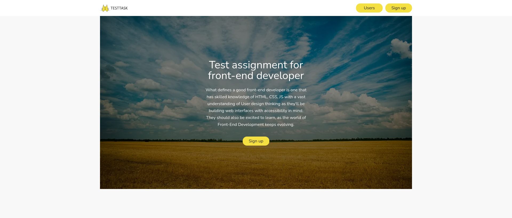

# Test task for abz.agency

## Demo

[Link](https://vasya-556.github.io/abz-agency/)


## Table of contents

- [Test task for abz.agency](#test-task-for-abz.agency)
    - [Demo](#demo)
    - [Table of Contents](#table-of-contents)
    - [Installation](#installation)
        - [1. Clone the Repository](#1-clone-the-repository)
        - [2. Install dependencies](#2-install-dependencies)
        - [3. Run frontend server](#3-run-frontend-server)
    - [Contributing](#contributing)
    - [License](#license)


## Installation

Follow these steps to get started

### 1. Clone the Repository
```bash
git clone https://github.com/Vasya-556/abz-agency.git
cd abz-agency
```

### 2. Install dependencies
```bash 
cd frontend
npm install
```

### 3. Run frontend server
```bash
npm start
```
The app should now be running at http://localhost:3000

## Contributing

Pull requests are welcome.

## License

[MIT](LICENSE)